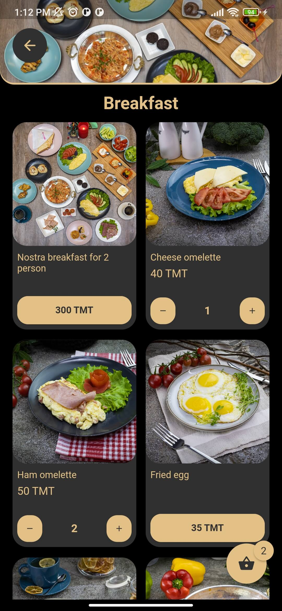
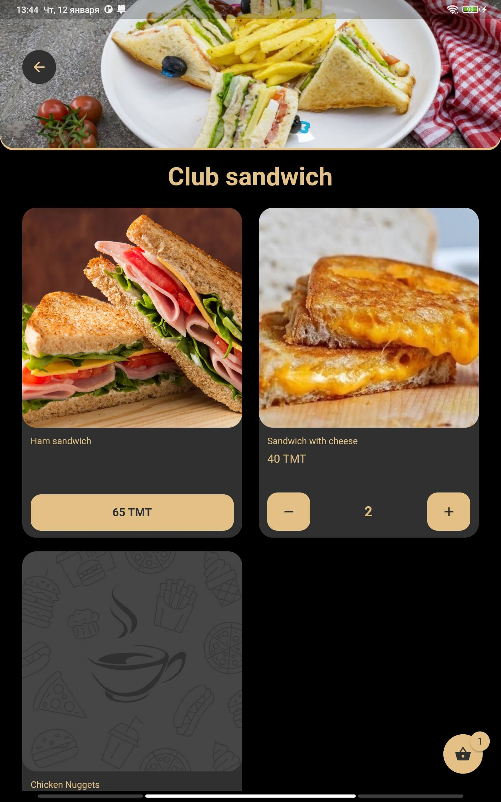

#  Yummify

Yummify is a fully-functional restaurant menu app to demonstrate how we can make a scalable, and maintainable app in an understandable manner using an MVVM inspired architecture in Flutter.

## :camera: Screenshots
### :camera: Phone screenshots:
| 1 | 2| 3|
|------|-------|-------|
||||

| 4 | 5| 6|
|------|-------|-------|
||||

### :camera: Tablet screenshots:
| 1 | 2| 3|
|------|-------|-------|
||||

| 4 | 5| 6|
|------|-------|-------|
||||


## :fire: App Features:
* Flutter + REST API (Backend Server, Storage)
  Url: http://185.223.93.215/login | Test account: operator@gmail.com / secret
* Use Stacked pattern
* Responsive (Mobil + Tablet)
* User-friendly interface
* Clean Architecture
* Custom resuable widgets
* Restaurant Categories
* Category meals with bottom sheet based on content height
* Use of local storage (Hive)
* Make your order and view it from admin panel
* More...

I plan to add more in the future (PRs welcome!).

## :pencil: Future Roadmap:

* Polish the UI
* Light/Dart Stacked Theme
* Add more screens/features/functionalities

## :books: Installation

- Clone the repo
  ```sh
  git clone https://github.com/Ruslanbek0809/Yummify.git
  ```
- And then we can use the normal build and run procedure
  ```sh
  flutter pub get
  flutter run
  ```
- Some files like `*.g.dart`, `*.iconfig.dart` are auto generated. If there is any issue from these files just run this command to regenerate them.
  ```sh
  flutter pub run build_runner build --delete-conflicting-outputs
  ```

## :package: Packages
This repository makes use of the following pub packages:
| Package | Version | Usage |
| ------ | ------ | ------ |
| [dio](https://pub.dev/packages/dio/versions/4.0.6) | ^4.0.6 | API*
| [connectivity_plus](https://pub.dev/packages/connectivity_plus/versions/3.0.2) | ^3.0.2 | Network*
| [stacked](https://pub.dev/packages/stacked/versions/3.0.1) | ^3.0.1 | State & Architecture*
| [stacked_services](https://pub.dev/packages/stacked_services/versions/0.9.9) | ^0.9.9 | State & Architecture Services* 
| [stacked_hooks](https://pub.dev/packages/stacked_hooks/versions/0.2.2) | ^0.2.2 | State & Architecture Tool* 
| [hive](https://pub.dev/packages/hive/versions/2.2.3) | ^2.2.3 | Storage*
| [hive_flutter](https://pub.dev/packages/hive_flutter/versions/1.1.0) | ^1.1.0 | Storage*
| [hive_generator](https://pub.dev/packages/hive_generator/versions/2.0.0) | ^2.0.0 | Code Generation for Storage*
| [shared_preferences](https://pub.dev/packages/shared_preferences/versions/2.0.15) | ^2.0.15 | Persistent Storage*
| [logger](https://pub.dev/packages/logger/versions/1.1.0) | ^1.1.0 | Logging*
| [flutter_hooks](https://pub.dev/packages/flutter_hooks/versions/0.18.5+1) | ^0.18.5+1 | Tool*
| [easy_localization](https://pub.dev/packages/easy_localization/versions/3.0.1) | ^3.0.1 | Localization*
| [collection](https://pub.dev/packages/collection/versions/1.17.0) | ^1.17.0 | Tool*
| [flutter_launcher_icons](https://pub.dev/packages/flutter_launcher_icons/versions/0.11.0) | ^0.11.0 | Tool*
| [json_annotation](https://pub.dev/packages/json_annotation/versions/4.7.0) | ^4.7.0 | Tool*
| [build_runner](https://pub.dev/packages/build_runner/versions/2.3.0) | ^2.3.0 | Code Generation for Others*
| [stacked_generator](https://pub.dev/packages/stacked_generator/versions/0.7.15) | ^0.7.15 | Code Generation for Stacked*
| [json_serializable](https://pub.dev/packages/json_serializable/versions/6.5.4) | ^6.5.4 | Code Generation for JSON*
| [cached_network_image](https://pub.dev/packages/cached_network_image/versions/3.2.3) | ^3.2.3 | Others*
| [flutter_screenutil](https://pub.dev/packages/flutter_screenutil/versions/5.6.0) | ^5.6.0 | Others*
| [carousel_slider](https://pub.dev/packages/carousel_slider/versions/4.2.1) | ^4.2.1 | Others*
| [flutter_svg](https://pub.dev/packages/flutter_svg/versions/1.1.6) | ^1.1.6 | Others*
| [flutter_spinkit](https://pub.dev/packages/flutter_spinkit/versions/5.1.0) | ^5.1.0 | Others*
| [flash](https://pub.dev/packages/flash/versions/2.0.5) | ^2.0.5 | Others*
| [shimmer](https://pub.dev/packages/shimmer/versions/2.0.0) | ^2.0.0 | Others
| [bottom_sheet](https://pub.dev/packages/bottom_sheet/versions/3.1.2) | ^3.1.2 | Others*
| [badges](https://pub.dev/packages/badges/versions/2.0.3) | ^2.0.3 | Others*
| [lottie](https://pub.dev/packages/lottie/versions/2.2.0) | ^2.2.0 | Others*
| [dropdown_button2](https://pub.dev/packages/dropdown_button2/versions/1.9.2) | ^1.9.2 | Others*

> *Recommended to keep regardless of your project.

## :star2: Conclusion
I will be happy to answer any questions, please feel free to submit an issue and/or pull request 🙂

If you liked my project, don’t forget to ⭐ star the repo to show your support.

## :lock: License
MIT © [Ruslanbek](https://github.com/Ruslanbek0809)
